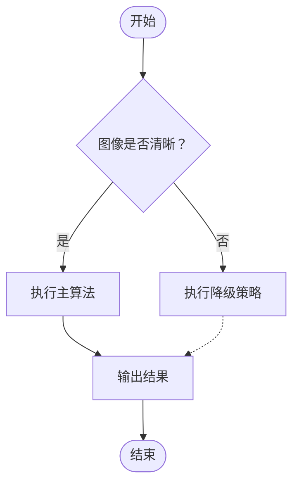
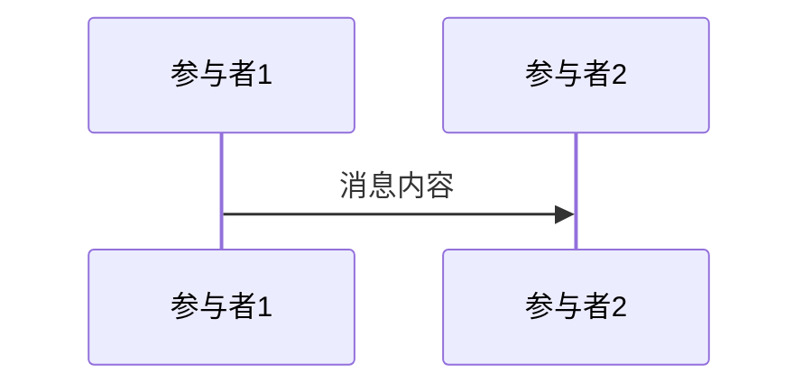
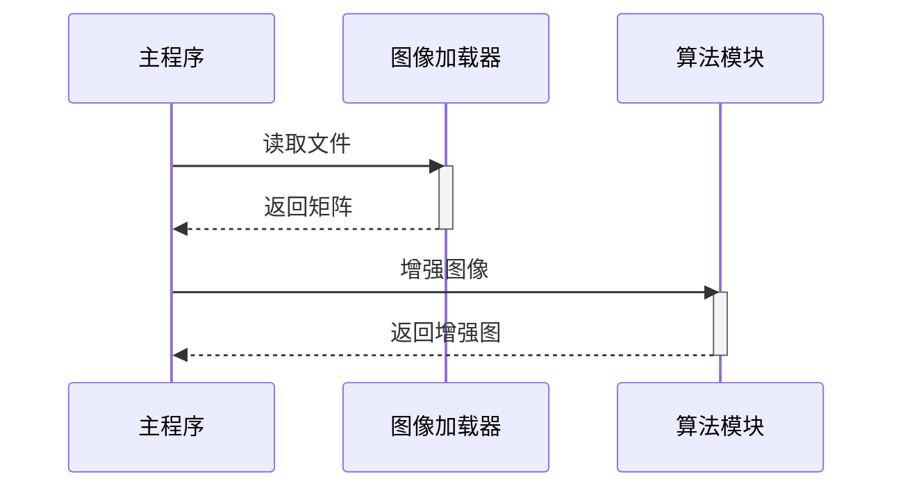
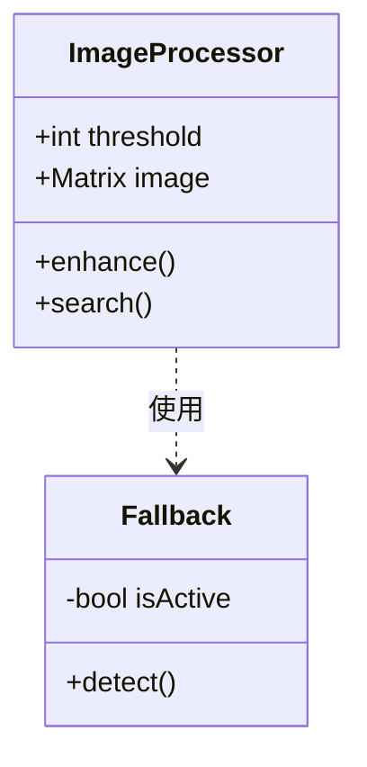
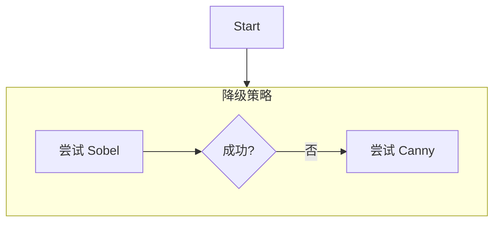
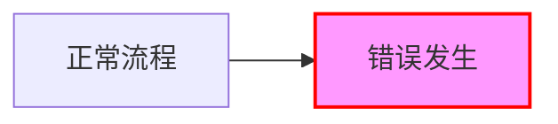
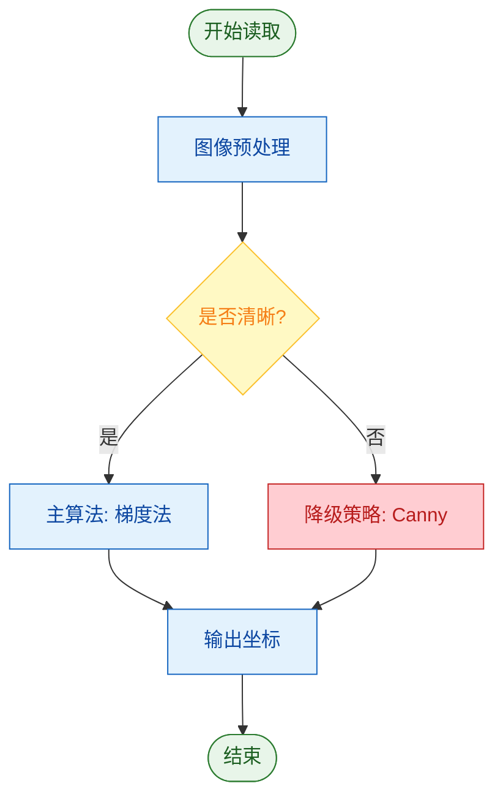

### Background
起因是在做学校的启蒙计划，就是一个熟悉科研流程的入门级项目。老师给了一个程序让我们先去研究和熟悉，以展示为导向去做这一个项目（原谅我们现在只是大一新生做不了什么很深奥的研究）。

但是在我入手程序的时候，我感觉直接把源代码复制粘贴出来并作为我学习笔记的一部分有“窃取”老师和实验室成果的嫌疑，于是我有了使用伪代码和逻辑图的方式来梳理程序实现思路的想法，这也能方便我们后续在展示的时候理清思路。

然而，单纯使用图形化的界面和已经开发成熟的商业化流程图软件来做流程图的确是一种解决办法，但是这需要在obsidian和其他APP内来回切换，而且还有主题适配等其他美观问题。那么，有没有一种用于写流程图的语言，既能在obsidian和github上显示时被渲染，又能满足我的流程图需求？

答案是有的，询问了AI之后给了我Mermaid这一个解决办法。
### Basic information
Mermaid 的核心逻辑其实非常简单，它本质上是一种 **“声明式”** 的绘图语言。你只需要告诉电脑 **“有什么元素”** 以及 **“它们之间有什么关系”** ，剩下的排版工作交给 Mermaid 的渲染引擎自动完成。
### Core logic
Mermaid 的渲染逻辑基于三个步骤：
1. 声明类型：告诉解析器要画什么类型的图（流程图，时序图，类图 or something else）
2. 定义节点：给元素起个 代号（ID）和 内容（文本）。
3. 定义关系：用箭头或线把节点连接起来。
> Tips: Mermaid 是基于文本的，因此可以通过git版本控制查看代码变动情况。
### Basic grammar
#### 流程图：  
这是写笔记最常用的图表，用于展示逻辑判断和步骤。
**基本结构（伪代码）：**
```meimaid
	graph 方向
		节点ID[节点文字] --> 节点ID[节点文字]
```

**A. 定义方向**
* ```graph TD```：从上到下
* `graph LR`：从左到右
* `graph BT`：从下到上

**B. 定义节点形状**
Mermaid 通过不同的括号来定义形状，这在表达逻辑时非常有用：

|语法示例|形状|含义/用途|
|---|---|---|
|`A[矩形]`|矩形|普通步骤、处理过程|
|`B(圆角矩形)`|圆角|**开始**或**结束**节点|
|`C{菱形}`|菱形|**判断/决策**（如 if/else）|
|`D[(圆形)]`|圆形|特殊状态|
|`E[[子流程]]`|双层矩形|代表一个复杂的子模块|
**C. 定义连接线与标签**
* `-->`：实线箭头（表示流向）
* `---`：无箭头实线（表示关联）
* `-.->`：虚线箭头（表示异步或备选路径）
* `==>`：粗线箭头（表示强调）

**带文字的连线（伪代码）：** 
```
A -- 是 --> B
A -- 否 --> C
```

**D. 完整示例**


#### 时序图：
当想要解析`main`函数如何调用具体某个模块时，可以使用时序图。
**基本结构：**

A. 定义参与者
* `participant`: 普通参与者（模块、类）
* `actor`：角色（用户、外部触发器、显示为一个小人）

B. 定义交互
* `->>`：实现箭头（同步调用，表示“请求”）
* `-->>`：虚线箭头（返回响应，表示“结果”）
* `activate` / `deactivate`：显示模块处于“忙碌”状态（生命线上的长条）

**完整示例：**

#### 类图：
适合展示代码结构，比如 `coarseSearch` 类里有哪些属性。
**基本结构：**
```
classDiagram
	class 类名 {
        类型 属性
        方法()
    }
```

**示例：**

### Advanced skills:
#### 子图
当逻辑太复杂时，可以用 `subgraph` 把相关节点框在一起（比如把“降级策略”里的步骤框起来）。

```
graph TD
    subgraph 降级策略
        A[尝试 Sobel] --> B{成功?}
        B -- 否 --> C[尝试 Canny]
    end
    Start --> 降级策略
```

#### 样式定制
可以给特定的节点上色，用来表示**关键路径**或**错误状态**。

**语法：** `style 节点ID fill:颜色,stroke:边框色,color:文字颜色`

### Conclusion
好了，到这里我对Mermaid语法已经有了一个基本的了解了，应该可以继续我的科研代码学习计划了。另外，在文章的结尾附上一份配色方案，用于流程图的制作。

### Scheme
| 风格      | 用途     | `fill`(背景)     | `stroke`(边框)   | `color`(文字)    |
| ------- | ------ | -------------- | -------------- | -------------- |
| **清爽蓝** | 主流程/处理 | `#e3f2fd` (浅蓝) | `#90caf9` (中蓝) | `#0d47a1` (深蓝) |
| **柔和绿** | 成功/开始  | `#e8f5e9` (浅绿) | `#a5d6a7` (中绿) | `#1b5e20` (深绿) |
| **警示黄** | 警告/判断  | `#fff9c4` (浅黄) | `#fff59d` (中黄) | `#f57f17` (深黄) |
| **错误红** | 异常/报错  | `#ffcdd2` (浅红) | `#ef9a9a` (中红) | `#b71c1c` (深红) |
| **极简灰** | 结束/次要  | `#f5f5f5` (灰白) | `#e0e0e0` (灰)  | `#616161` (深灰) |
#### 效果展示：

