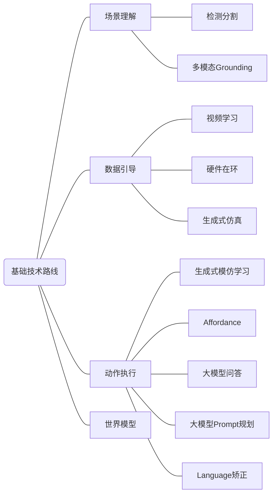

# Embodied AI 定义
Embodied AI：集成 **环境理解、智能交互、认知推理、规划执行** 于一体的系统化方案。
## 如何理解？
从**环境理解**层面来说，包括目标检测模型，目标分割模型一类，重点关注CV领域；
**智能交互**，主要是语音识别一类，通过 语音 -> ASR -> LLM -> TTS -> 语音 一整条链路形成智能交互；
**认知推理**，利用大语言模型的智能，根据环境理解等基础信息，对复杂任务进行拆解；
**规划执行**，根据认知推理结果进行系统化集成。

---
# 几个例子
## LLM As General Planner
> Sai Vemprala et. al., ChatGPT for Robotics: Design Principles and Model Abilities, 2023

经过各种来源数据训练而成的LLM，其内蕴的 Common Sense 以及思维逻辑，能够成为面向机器人的General Planner。
基本实现思路就是编写 API 库，大语言模型根据 prompt 调用API接口进行代码编写，用于机器人执行。
在这个过程中，LLM 作为一个桥接人类指令意图到具体规划代码生成的媒介。
## Navigaiton

> Matthew Chang et. al., GOAT: GO to Any Thing, 2023
### 抽象理解
抽象地来看，整个过程大致分为以下几个步骤：

1. 实例分割  & 深度估计 ：
通过处理数据解决 ”环境是什么“ 的问题。通过分割，机器人知道哪些像素分别属于哪个物体；通过深度估计，机器人知道物体的位置。这些数据提供了关键的空间数据。

2. 投影建图：
显式地构建”认知地图“。它将前面两步得到的带有语义和深度信息的像素点，投影到世界坐标系之中，形成一个3D的”语义地图“。这个地图记录了每个物体实例的类别和精确位置。

3. 图像匹配：
解决的是 ”识别目标“ 的问题。当目标以一张图片的形式给出的时候，机器人需要知道地图内的哪个物体和这个图片是一个东西。通常通过匹配特征点，实现这种细粒度的实例级识别。

4. 文本与图像匹配：
解决的也是”识别目标“问题。当目标是文本形式的时候，这一个步骤就负责将文本描述与地图中存储的物体视觉特征进行匹配。它让机器人具备了零样本 (zero-shot) 泛化能力，即使它从未见过”马克杯“这个类别，也可以通过”红色“、”杯子“等概念来识别目标。

5. 指令解析：
解决”用户想做什么“的问题。这是系统的”大脑“，用户的指令是复杂的自然语言，这一步骤使用大语言模型抽提出关键的物体类别，将模糊的人类语言，翻译成明确的导航目标。

#### 具体使用的工具
- 使用 MaskRCNN 实例分割进行目标检测和像素分割
- 使用 MiDaS 单目深度估计进行 RGBD 传感器数据修复
- 分割后的 RGBD 投影通过 Semantic Map 进行环境建图
- 使用 SuperGLUE 进行图像与图像匹配
- 使用 CLIP 进行文本与图像匹配
- 使用 Mistral 7B 从复杂指令中抽提 Object Category
## Navigation & Grasping
> Peiqi Liu et. al.,OK-Robot, 2024
#### 步骤解读
1. AnyGrasp生成抓取候选 (Grasping Candidates) ：
解决”怎么抓“的问题，通过分析场景的RGB-D图像，为物体生成大量可能的抓取姿态。
2. Lang-SAM 分割特定文本物体 Mask：
解决”目标在哪“以及”抓哪里“的问题，通过结合文本和图像，精确找到用户指定的物体并生成其轮廓 (Mask) 。
3. 基于规则在 Mask 内选择最终 Grasping Pose：
解决”抓得准“的问题，从AnyGrasp生成的众多候选中，筛选出目标物体 Mask 内的最优抓取点。
---
# 基础技术路线

## 1.0 场景理解
### 1.1 分割、检测
**分割**：SAM / SAM3D，在2D图片/3D空间中做场景分割，输出精确的Mask

**检测**：Open-Voc Detection / Open-Voc Detection in Point Cloud，通过开放词汇检测提高系统的泛化性，能够识别没有见过的物体
### 1.2 多模态Grounding
#### 1.2.1 多模态Grounding (Image)
多模态（文本、图像）大模型能够实现像素级别的细粒度Grounding，表征着大模型的理解能力大幅度提高。

区别于分割检测模型，多模态Grounding不仅能够识别物体，还能做到语义级的深度理解来消除歧义，具体实现离不开视觉推理、常识对齐等能力，难点在于物体的外观变化。

换句话说，多模态Grounding还需要诸如颜色、逻辑关系、遮挡关系、深度信息（前景背景）、常识等相关的词汇，并通过这些信息进行更加精确的物体定位。

举例：
> Hanoona Rasheed et. al., GLaMM: Pixel Grounding Large Multimodal Model, 2023
#### 1.2.2 多模态Grounding (3D)
和 Image 方面的多模态模型相同的是，它们都是为了解决”消除指代歧义“这个问题而存在的，核心使命都是”跨模态对齐“，把”抽象的文本/语音“和”具体的视觉/空间信号“在数学上绑定在一起。

不同的是，3D多模态接受的是点云等数据，输出的是3D空间位姿，难点在于”几何残缺“。

多模态、多任务赋能的LLM具有更加通用的场景理解能力。

举例：
> Jiangyong Huang et. al., An Embodied Generalist Agent in 3D World, 2023
## 2.0 数据引导

传统的机器人模仿学习，主要依赖”遥操作“（Teleoperation），即人类通过手柄等方式手把手地教机器人做动作，但是这种方式采集到的数据成本高，效率低，样本容量低。于是，目前为了解决这个问题，目前主流的方式有以下几种：
### 2.1 From video
"From Video" 的思路就是旨在通过大量容易获得的人类视频作为学习素材，其核心挑战主要包括以下几点：
形态鸿沟（人手和机器人夹具不同），环境鸿沟（原视频环境和执行环境不同），视点错位问题，动作与动力学的不可观测性（无法采集力信息），时间节奏与速度，意图与冗余动作混杂。
##### MimicPlay
大致实现思路就是分层模仿学习：
High-level Planner学习人类的交互意图和物理常识，预测未来需要完成的关键子目标；
Low-level Controller学习怎么做，通过前一步获得的子目标生成具体的电机控制信号并实现。
> Chen Wang et. al., MimicPlay: Long-Horizon Imitation Learning by Watching Human Play, 2023
#### Vid2Robot
采用端到端的学习方式，直接学习从 ”输入“ 到 ”输出“ 的映射，中间不进行人为的任务分解。
系统通过一个统一标识模型，使用交叉注意力变换器 (Cross-Attention Transformers)，将人类演示视频和当前机器视觉观察进行融合，直接生成机器人的动作指令。
> Vidhi Jain et. al., Vid2Robot: End-to-end Video-conditioned Policy Learning with Cross-Attention Transformers, 2023
### 2.2 Light-weight Hardware
实现思路主要是通过消费级设备代替专业设备，通过融合多传感器来弥补单个设备的能力不足，从而降低数据采集的成本。
核心挑战在于数据质量的一致性，硬件限制与精度损失，跨本体泛化难题，部署与计算资源约束等。
#### UMI
操作者手持轻量化的夹具（通常集成了摄像头和传感器）去真实环境操作，记录下来夹取物体，人的操作意图，运动轨迹和多模态感知，并统一到一个通用的数据接口中。
在采集过程中主要保证可迁移性，通过设备上的鱼眼相机捕捉丰富的环境信息，数据记录的是相对运动而非绝对位置，通过技术手段确保采集数据的时间节奏与机器人执行时匹配。
采集的数据用于训练通用的策略模型，训练好的策略可以零样本（zero-shot）部署到不同型号的机器人上。
#### DexCap
使用一副轻便的手套或者外骨骼，集成多种传感器，使得系统不依赖单一视觉，实现抗遮挡的精确追踪。采集到数据后，再通过配套的 DexIL 模仿学习算法，克服了人机形态鸿沟。此外，DexCap还提供了一个可选的人机交互校正机制，人类可以通过系统实施修正机器人首次任务出现的偏差。
#### HIRO Hand
采用腱驱动机制，通过一个只管的人机交互过程工作，操作者像提线木偶一样直接完成动作。在这个过程中，HIRO Hand记录下关节的运动轨迹和力信息。
HIRO Hand采用两层策略来学习和执行，底层使用PID控制器执行，高层使用视觉模仿学习进行决策和操作。
该方法解决了数据引导的形态鸿沟、力信息缺少和成本昂贵（成本约400美金）等问题。
### 2.3 Heavy Hardware
通过高精度、高负载、高成本的专业工业级机器人平台以及专业遥操作数据采集系统进行数据采集，该方法需要操作手使用VR设备等方式代替传统主手操作，一定程度上减小数据采集成本和操作效率及精度。
典型的代表有 Sanctuary AI 和早期的 Tesla
### 2.4 Generative Simulation
对于传统仿真来说，需要工程师在仿真环境中搭建真实的环境和物体，并手动编写逻辑和奖励函数，但是在生成式仿真 (Generative Simulation) 中，仿真环境的搭建由AI根据自然语言描述生成，并通过LLM自动分解任务生成对应奖励函数。
使用这种方法的优势在于由AI生成的仿真环境和物体有无限的多样性，某种程度上提高了模型的泛化性能。
然而，由于AI幻觉等问题，生成的内容可能不符合物理规律，有黑箱问题。这对数据评估和筛选，从仿真到现实的迁移都提出了更高的要求。
#### RoboGen
由LLM总领，提出机器人需要学习的新技能和任务；生成式模型根据提出的任务自动创建相应的仿真环境，包括布局物体、设置参数等；最后由多种学习算法进行任务分解和方法选择，达到训练的目的。
> Yufei Wang et. al., ROBOGEN: TOWARDS UNLEASHING INFINITE DATA FOR AUTOMATED ROBOT LEARNING VIA GENERATIVE SIMULATION, 2023
#### MimicGen
区别于RoboGen，MimicGen使用了一个数据扩增系统，它以少量（≈200个）高质量人类演示数据，通过几何变换扩增为海量（超过5万个）的合成演示数据进行训练，而不是像 RoboGen 一样完全凭空生成，一定程度上提高了训练数据的质量。
> Ajay Mandlekar et. al., MimicGen: A Data Generation System for Scalable Robot Learning using Human Demonstrations, 2023
## 3.0 动作执行
传统的机器人实现动作主要依赖以下几种方式：示教再现、离线编程、模型控制。然而，这些方法刚性僵化、无法理解语义，而且部署成本极高。
为了从一定程度上解决上面提到的问题，近年来的基本实现路径如下。
### 3.1 Generative Imitation Learning
不再机械地克隆专家动作，而是让机器人学会理解并生成专家行为背后的意图和模式。核心思路在于学习专家演示数据的整体分布，而不是预测一个最佳动作，从而通过学习大量演示数据，掌握一套生成合理动作的规则。
#### 扩散模型
以 **Diffusion Policy** 为代表的扩散模型，通过 "加噪 - 去噪" 的过程来学习。训练时，通过给专家动作轨迹添加噪声，让机器学习如何进行去噪的方式，使得机器能够最终执行时生成平滑可行的动作序列
#### 生成对抗模仿学习
以 **GAIL** 为代表，这是一种比较早的方法。它引入两个互相对抗的AI，一个做 “生成器” ，一个做 “判别器”，判别器根据专家轨迹数据集进行训练，能够判断一条轨迹和专家轨迹相似度（区分有多像专家轨迹），而生成器通过生成机器人动作轨迹给判别器进行判断，再根据判别器返回的反馈进行轨迹调整，从而实现动作执行的稳定性。
#### ACT (Action Chunking with Transformers)
这种方法不预测单个动作，而是预测一段连续的动作序列 (Action Chunk) 。它使用Transformer架构，将一段时间的观察和动作历史作为输入，直接生成未来一段时间的动作序列，从而解决传统模仿学习单步预测抖动的问题。同时，ACT还引入了潜在变量 (z) ，在预测前随机采样一个意图向量 (z) 之后再生成动作块，ACT能生成不同风格的动作，解决了“多模态行为”问题。
### 3.2 Affordance
对于“Affordance”这个概念，可以理解为机器人的行动直觉。通过这条途径，需要让机器人不仅仅停留在识别物体是什么的层面，还要让机器人理解怎么用以及在哪里用的问题。
#### RoboAffordance
通过使用`RoboAfford`数据集，弥补了VLM在精细动作位置预测上的缺陷，能够进行物体可供性识别，物体可供性预测，空间可供行定位等功能。该方案构建了目前业内规模领先且同时覆盖物体和空间可供性的精细标注数据集；同时，支持多模态学习并统一了操作和导航两大任务的可供性学习；此外，提出了`RoboAfford-Eval`基准，提供了一个标准化的考核平台。
> Shikhar Bahl et. al., Affordances from Human Videos as a Versatile Representation for Robotics, 2023
#### AffordPose
核心目的是为了构建一个大规模、高质量的3D数据集。该数据集通过精细的 part-level 可供性标注，来揭示物体功能与手部姿态之间的关联。主要解决的是现有数据集在语义和功能层面上的缺失问题。
区别于其他的Affordance方案，该研究侧重于执行层面，目标是将泛化的功能性语言转化为切实可行的动作语言。
> Juntao Jian et. al., AffordPose: A Large-scale Dataset of Hand-Object Interactions with Affordance-driven Hand Pose, 2023
### 3.3 Q&A from LLM
传统机器人只能被动接受指令并执行，并且只能处理简单和指令清晰的任务。在这样的语境下，Q&A from LLM 通过 LLM 让机器人能够主动探索理解物理世界，并主动与物理世界产生交互。
#### ManipLLM 
区别于其他研究将大语言模型仅用于高层任务规划，ManipLLM 直接将大模型作用于预测 low-level 的动作参数，直接进行工作。同时，预测的动作参数是“以物体为中心”，提高了机器人的泛化能力。
> Xiaoqi Li et. al., ManipLLM: Embodied Multimodal Large Language Model for Object-Centric Robotic Manipulation, 2023
#### ManipVQA
ManiqVAQA旨在解决一个根本性矛盾：MLLM拥有强大的通用视觉和语言理解能力，却缺乏机器人操作所需要的物理常识。（可供性理解缺失）
因此，总体来说，ManipVQA是将机器人操作这个复杂问题转化为模型更擅长的视觉问答 (VQA) 任务。
该方案通过一个统一的操作知识VQA框架，将工具检测、可供性识别和物理概念理解三大任务，全部统一为问答的格式；并通过微调方法，在诸如新机器人知识的同时，保留了MLLM原有的通用视觉推理能力。
> Siyuan Huang et. al., ManipVQA: Injecting Robotic Affordance and Physically Grounded Information into Multi-Modal Large Language Models, 2023 
### 3.4 Prompt Planning from LLM
核心思路在于放弃传统的数据采集和模型训练，直接使用现有的大模型能力，让机器人拥有世界常识和零样本泛化能力。这一方法在于上层的创新，下层的动作执行还是没变。

> 代表文章：Yingdong Hu et. al., Look Before You Leap: Unveiling the Power of GPT-4V in Robotic Vision-Language Planning, 2023

这篇文章的核心创新点在于 **ViLa** ，它将视觉信息直接融入规划和推理过程，构建一个统一的多模态系统。依赖 GPT-4V 这类大型LLM，ViLa 能直接整合视觉数据和语言指令（原生多模态融合）；能理解空间布局、物体属性等视觉常识（深度视觉常识理解）；支持多模态目标指定并支持经执行中的视觉反馈用于重新规划（灵活的输入与反馈）；将高层规划与感知融合，生成一些列可执行的步骤（从规划到执行的贯通）。
### 3.5 Language Corrections
简单来说，就是让机器人能够听懂人类的自然语言批评，并当场改正。主要解决了传统机器人执行长任务时人工介入成本高的问题，降低了人机协作门槛。
#### OLAF 
OLAF 让机器人不仅能听懂当下的口头批评，更能将这些反馈内化为自己的记忆的一部分，实现经验积累的持续学习能力。
为了实现该能力，OLAF 采取了一套独特的循环机制：利用LLM解析人类的语言反馈，转化为机器人可以理解的具体操作指令；利用解析后的指令，对机器人原本失败的轨迹进行重新标注（Operation-relabelling），生成修正后的示范轨迹；正确的轨迹被用作新的训练数据，用来跟新机器人内部的视觉运动策略。
#### YEll At Your Robot (YAY Robot)
与 OLAF 相似，YAY Robot 主要针对的是长时程任务中，让机器人通过人类语言实时纠正，并从反馈中持续学习的问题。
两者实现方式相似，区别是 YAY Robot 是在任务进行过程中实时干预，而 OLAF 是在任务结束之后通过结束后的反馈进行轨迹调整；其次，前者是通过端到端学习，而后者依赖 LLM 的理解反馈；再者，前者通过迭代微调 (Iterative Fine-Tuning) 的高层策略来学习，后者更新视觉运动策略来学习。相同的是，两个方案都会用新的正确轨迹对原有模型进行微调，达到持续学习的效果。
## 4.0 世界模型
这个方案旨在为机器人构建一个内部的、可模拟的世界，让它能像人类一样，在行动之前先想象和预演，这个方案主要解决的是让机器人具备真正的通用化与泛化能力。
然而，该方向底层逻辑类似于在仿真环境预测后再进行决策的思路，这种方案仍然面临着缺乏对力数据等脱离物理现实的问题，并且需要巨大算力，可能难以满足机器人的实时控制要求。
#### 3D-VLA
针对之前VLA模型中的2D思维局限和无法预测的反应式决策局限，3D-VLA 建立在3D基础大语言模型上，能直接处理3D点云等3D数据，并通过引入 Interaction tokens 让模型能与虚拟的3D环境交互。此外，该方案训练了一系列 Embodied Diffusion Models 并将其与 LLM 对齐，这使得模型能预测未来的目标图像和点云。
