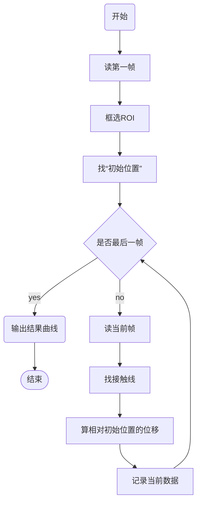
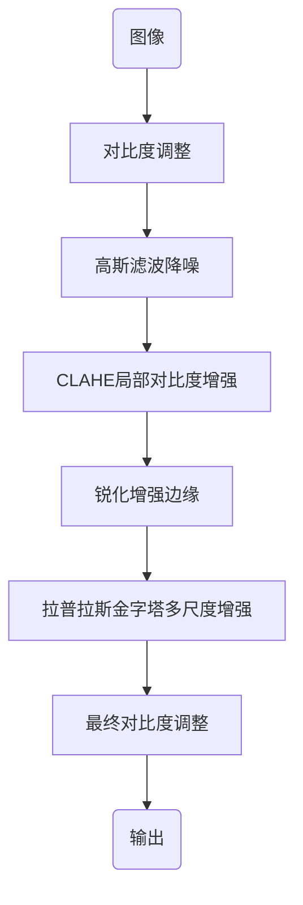

# 一、整体程序流程（Line_Tracking）

# 二、核心函数
>无论使用了什么方法，最终目的都是找到接触线的中心，即找到最暗的连续区域
## 粗搜索
### 作用：
在ROI中找到接触线的大致位置
### 算法思路：
1. 在整个ROI区域中取两个搜索区，分别为左搜索区和右搜索区
2. 取每个区域中每一列灰度值最低的点，得到一系列点阵
3. 将左右两边的点两两连接并拟合，并将每一条直线进行拟合分析
4. 保留最符合的一条直线的两个点和对应的直线方程参数
5. 将数据传入亚像素搜索进一步定位
## 亚像素搜索
### 作用：
进一步定位接触线的位置
### 算法思路：
1. 在粗搜索得到的两个点附近创建亚像素y坐标
2. 对于每一个x位置，插值计算13像素带的灰度
3. 选择 maxgray < threshold 的y，取平均，得到最终精确的直线方程参数
### 核心公式
$$
f(x+\Delta x) = f(x) + f'(x)\Delta x
$$
e.g. 以0.3为步进为例计算：
$$
known: f(x+1) = f(x) + f'(x)
$$
$$
\begin{align}
so: f(x+0.3) &= f(x)+0.3f'(x) \nonumber \\
&=f(x)+0.3(f(x+1)-f(x)) \\
&=0.3f(x+1) + 0.7f(x)
\end{align}
$$
# 三、图像处理
## 图像增强
### 整体流程

*鉴于本人精力和学识有限，图像增强部分只简单说明一下每一个模块大概干了什么事情以及每个模块大概实现思路，不做原理分析和理论研究*

#### 对比度调整
将图像的灰度值拉伸到[0,1]的范围，去除1%和99%分位数，只保留中间的98%的有效信息
#### 高斯滤波降噪
用高斯核平滑图像，卷积处理，减少噪声
#### CLAHE 局部对比度增强
对ROI区域局部对比度增强，将图像分为 8x8 的小块，每块做直方图均衡化，同时使用ClipLimit限制对比度过度增强
#### 锐化增强边缘
复制一张原图，将复制后的图片模糊化处理，将两张图片相减，再把边缘加回去
#### 拉普拉斯金字塔多尺度增强
