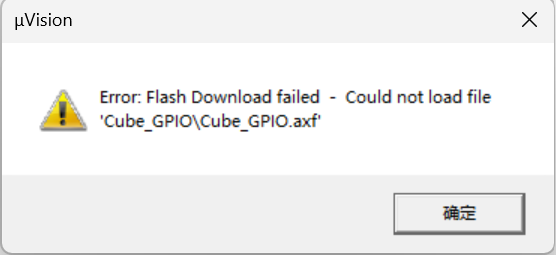
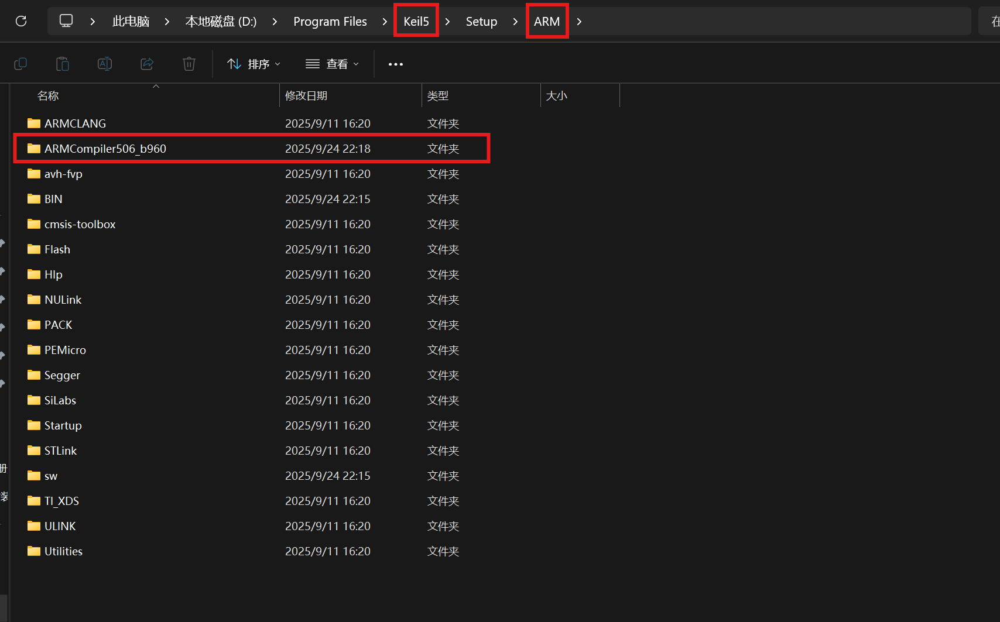
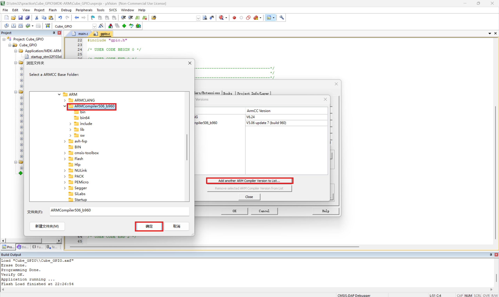
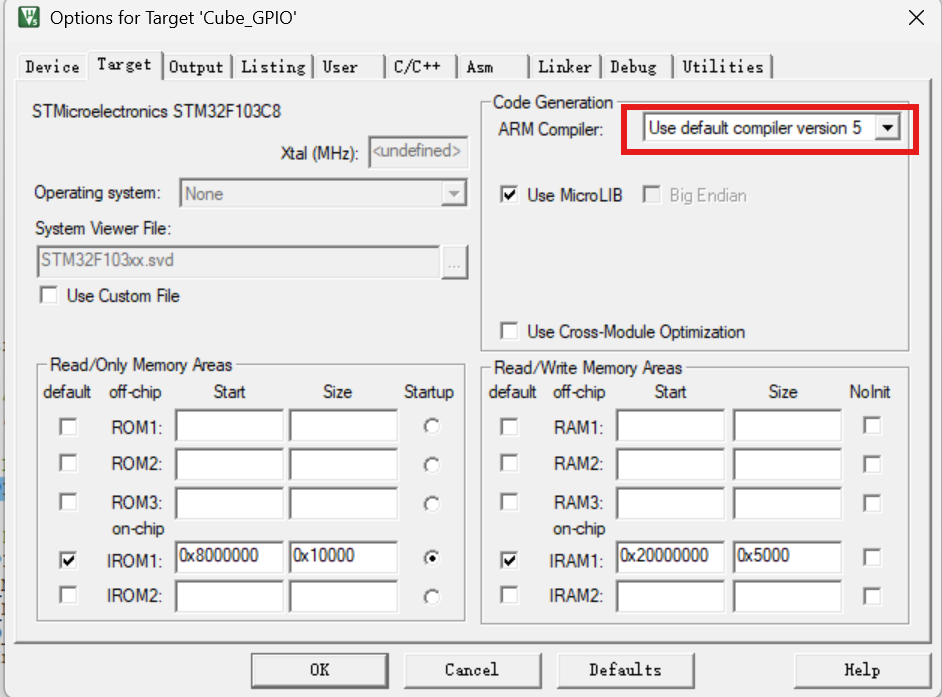

2025-09-24
关于keil5新版本（5.37及以后）不再内嵌arm compiler v5导致的报错问题。如下图：

解决办法：
1.下载arm compiler version 5：找官网或民间网盘。（官网下载地址：[Legacy Arm Compiler 5, 4.1, and RVCT (ACOMP5)](https://developer.arm.com/downloads/view/ACOMP5)
2.把compiler下到和v6并行的地方，如下图：

3.打开keil5把该compiler加进去，如下图：

4.点击ok关闭后就能正常使用啦：

